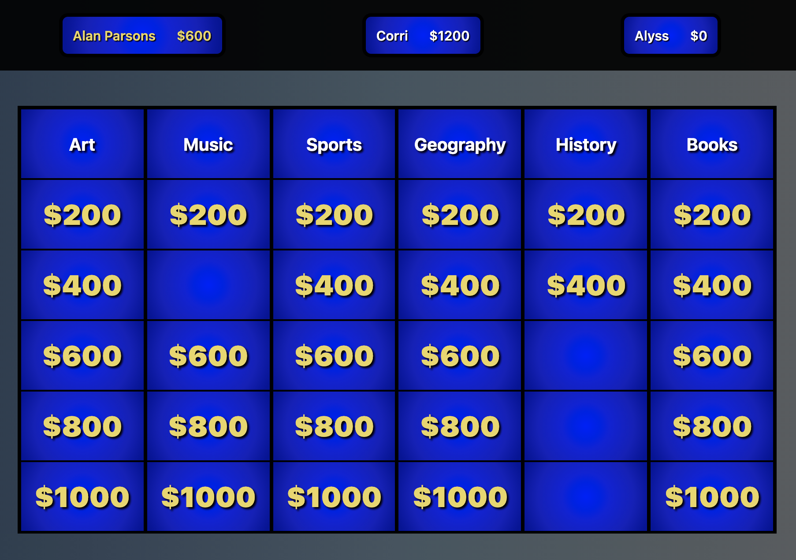
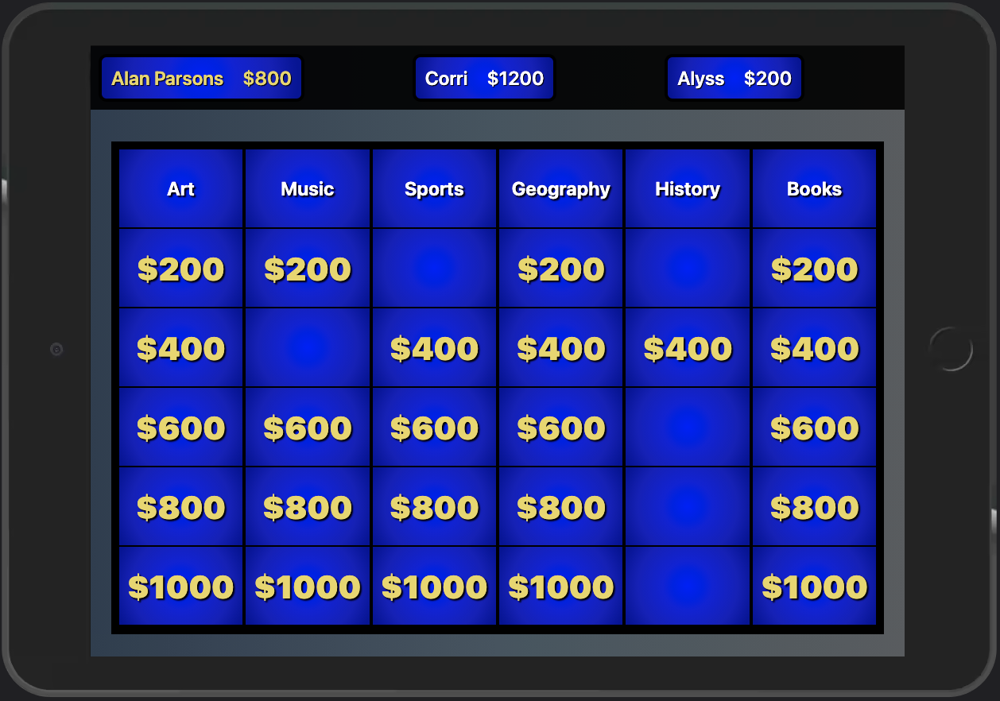
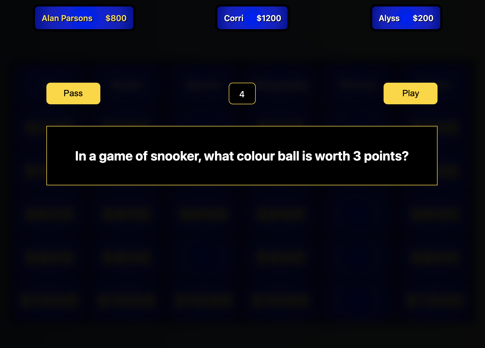
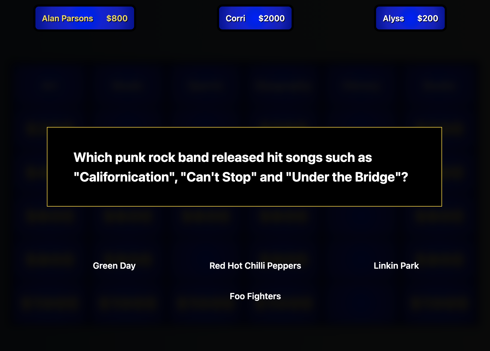

<h1 align="center">Welcome to General Knowledge 👋</h1>
<p>
  
  <a href="https://twitter.com/ScottJellen" target="_blank">
    
  </a>
</p>

> A multi round trivia game with random computer player names and computer intelligence.

### Screenshots


  



  


  


  



  


### 🏠 [Homepage](https://generalknowledge.vercel.app/)

### ✨ [Demo](https://generalknowledge.vercel.app/)

## Install

```sh
npm install
```

## Usage

```sh
npm run start
```

## Author

👤 **Scott Jellen**

* Website: ScottJellen.com
* Twitter: [@ScottJellen](https://twitter.com/ScottJellen)
* Github: [@SJellen](https://github.com/SJellen)
* LinkedIn: [@scottjellen](https://linkedin.com/in/scottjellen)

## Show your support

Give a ⭐️ if this project helped you!

***
_This README was generated with ❤️ by [readme-md-generator](https://github.com/kefranabg/readme-md-generator)_